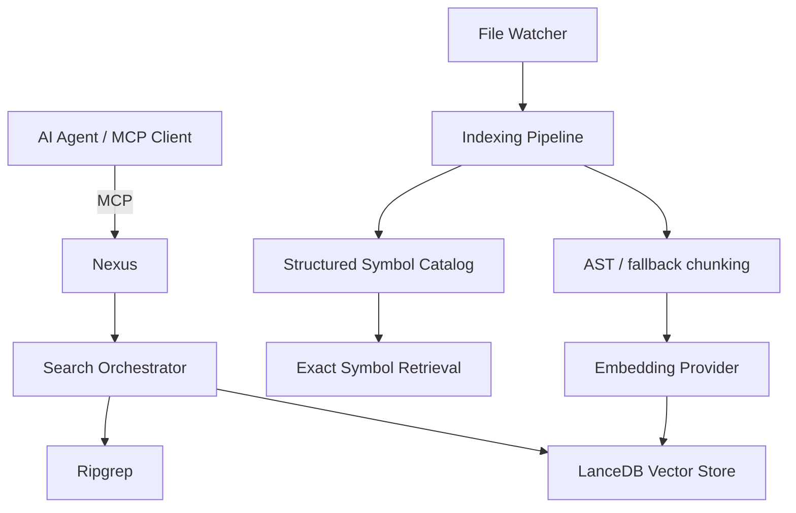

# Nexus

[English](README.md)

[](https://opensource.org/licenses/MIT)
[](https://modelcontextprotocol.io/)

**高速で根拠のあるコード検索と正確なシンボル取得を提供する、ローカルファーストの MCP コードインデックスです。**

Nexus は、大規模なコードベースを AI エージェントが毎回ファイル全体を読み込まずに調査できるようにします。semantic search、ripgrep、AST ベースのインデックス、正確なシンボル取得、範囲を絞ったコンテキスト取得を 1 つのローカル MCP サーバーとして提供します。

> [!IMPORTANT]
> **v2 には破壊的変更があります。** MCP ツール契約、CLI オプション、設定キーが v1 から変更されています。移行時は現在の [MCP ツールリファレンス](docs/mcp-tools.md) と [設定リファレンス](docs/configuration.md) を参照してください。

## Quick Start

### 必要条件

- Node.js 24 以上
- npm
- embedding provider。デフォルトのローカル provider は Ollama です。

### インストールと起動

リポジトリから試す最短経路:

```bash
git clone https://github.com/yohi/nexus.git
cd nexus
npm ci
npm run build
node dist/bin/nexus.js
```

公開パッケージ `@yohi/nexus` は GitHub Packages を使用するため、registry と認証の設定が必要です。Package Usage は [Setup](docs/setup.md) を参照してください。

デフォルトでは、プロジェクトローカルのインデックスデータを `<projectRoot>/.nexus` に保存します。

### インデックスを確認

MCP クライアントを `nexus` コマンドへ接続し、`index_status` を呼び出します。

利用可能なインデックスでは `indexStats.lastIndexedAt` が non-null で、`pipelineProgress.lastError` がありません。初回インデックスはバックグラウンドで進み、処理中でも検索できますが結果が不完全な場合があります。

クライアント別設定と Source Build / Package Usage の選択は [Setup](docs/setup.md) を参照してください。

## Features

- **Hybrid search** — semantic vector search と ripgrep を Reciprocal Rank Fusion で統合
- **Exact search** — ripgrep による高速な文字列・正規表現検索
- **Structured symbol retrieval** — TypeScript/JavaScript、Python、Go、Rust、Java、C#、C、C++ の stable `symbolId`、正確な source、bounded context、file outline
- **Incremental indexing** — file watcher、差分検出、recovery queue による継続更新
- **Local-first operation** — Ollama 利用時は source-derived embedding data をホスト内に保持可能。外部 embedding provider を設定した場合は source-derived text がそのサービスへ送信される場合があります。
- **Observability** — Prometheus metrics と multi-process dashboard/aggregator
- **HTTP bridge / server modes** — stdio client から project-scoped local HTTP server へ接続可能

## Agent Setup

リポジトリ全体の AI agent ルールの正本は [AGENTS.md](AGENTS.md)、コード検索ワークフローの正本は [.agents/skills/code-search.md](.agents/skills/code-search.md) です。

### AI コーディングエージェントでセットアップする

以下のプロンプトを AI コーディングエージェント（Claude Code、Cursor、OpenCode など）に貼り付けてください。エージェントがリポジトリと環境を確認し、適切なセットアップ手順を実行します。

```text
Set up this repository for local development. Read and follow AGENTS.md, then use docs/setup.md as the canonical setup source.
```

典型的な検索フロー:

1. `index_status` を確認
2. 概念探索は `hybrid_search`、正確な文字列は `grep_search`
3. 結果に利用可能な `symbolId` があれば `get_symbol_source` または `get_symbol_context` を優先
4. 行指向の hit、structured retrieval が unsupported/degraded の場合、その他 non-symbol の場合は `get_context`

公開 MCP ツールの完全な参照は [MCP Tools](docs/mcp-tools.md) を参照してください。

## Usage

### インデックスを再構築

```bash
nexus --reindex
nexus --reindex --full
```

`--full` は clean full rebuild を実行します。

### ローカル HTTP MCP サーバー

```bash
nexus serve
nexus serve --host 127.0.0.1 --port 9200
```

Local HTTP v2 は loopback-only です。現在の transport / safety invariant は [SPEC.md](SPEC.md) を参照してください。

### stdio HTTP bridge

```bash
nexus http-bridge
```

project-scoped local HTTP server を検出または起動し、stdio JSON-RPC を Streamable HTTP endpoint へ転送します。

### Dashboard

```bash
nexus dashboard
```

Aggregator と Grafana/Prometheus の設定は [Observability](docs/observability/README.md) を参照してください。

## How It Works



検索 chunk と logical symbol は別の retrieval unit です。semantic search の結果から symbol を特定し、structured retrieval で current working tree から complete logical declaration を検証して取得できます。

現在の architecture invariant と behavioral contract は [SPEC.md](SPEC.md) を参照してください。

## Configuration

Nexus は `.nexus.json` を読み込み、対応する設定は環境変数で override できます。代表例:

| Setting | Purpose |
| --- | --- |
| `NEXUS_STORAGE_ROOT_DIR` / `storage.rootDir` | インデックス保存先 |
| `NEXUS_EMBEDDING_PROVIDER` / `embedding.provider` | `ollama`, `openai-compat`, `bedrock` |
| `NEXUS_WATCHER_IGNORE_PATHS` / `watcher.ignorePaths` | watcher/index の追加除外 |
| `NEXUS_PACKAGE_MODE` / `packageMode` | package distribution 制約 |

完全な設定契約は [Configuration](docs/configuration.md) を参照してください。

## Documentation

| 読者 / タスク | 正本 |
| --- | --- |
| 現行 architecture、invariant、compatibility、transport behavior | [SPEC.md](SPEC.md) |
| AI agent の repository instructions | [AGENTS.md](AGENTS.md) |
| Code-search agent workflow | [.agents/skills/code-search.md](.agents/skills/code-search.md) |
| MCP tools / inputs / outputs / statuses | [docs/mcp-tools.md](docs/mcp-tools.md) |
| Installation / client setup | [docs/setup.md](docs/setup.md) |
| Runtime configuration | [docs/configuration.md](docs/configuration.md) |
| Distribution / operator workflow | [docs/distribution.md](docs/distribution.md) |
| Metrics / dashboards | [docs/observability/README.md](docs/observability/README.md) |
| 将来計画 | [ROADMAP.md](ROADMAP.md) |
| Release history | [CHANGELOG.md](CHANGELOG.md) |

## Development

```bash
npm ci
npm run build
npm run lint
npx tsc --noEmit
npx vitest run
```

特定 subsystem の変更では focused test から始め、完了前に必要な全体チェックを実行してください。

## License

MIT. [LICENSE](LICENSE) と [NOTICE](NOTICE) を参照してください。
