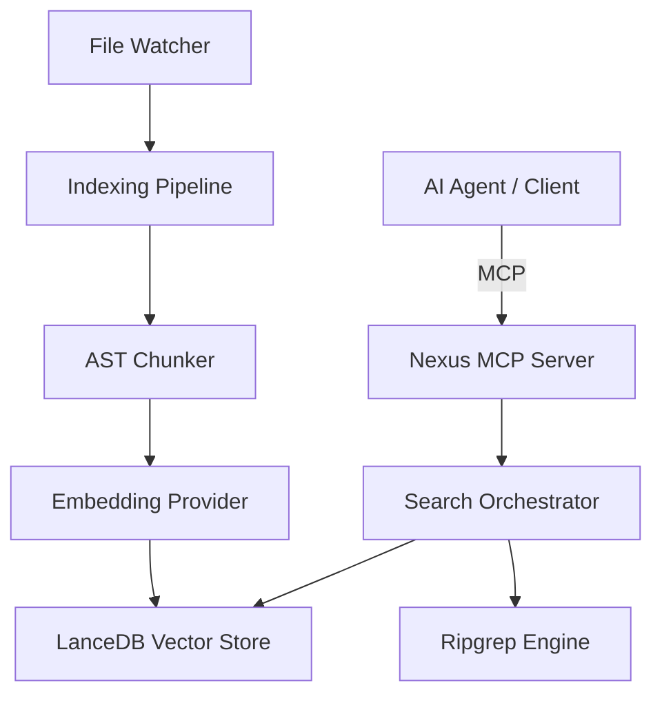

# Nexus ⚡️

**AI エージェントのための、ローカル MCP ベース・コードインデックス基盤**

[](https://opensource.org/licenses/MIT)
[](https://modelcontextprotocol.io/)

Nexus は、AI エージェントが巨大なコードベースを効率的に理解し、正確なコンテキストを取得するための MCP (Model Context Protocol) サーバーです。
Semantic search、Exact grep search、File context 取得を 1 つのローカルインデックスに集約し、高速かつ一貫性のある検索体験を提供します。

## 🚀 特徴

- **ハイブリッド検索**: LanceDB によるベクトル検索と ripgrep による高速な文字列検索を統合。
- **インテリジェント・チャンキング**: AST 解析に基づき、関数のセマンティクスを維持したままコードを分割。
- **低レイテンシ**: ローカル実行に特化し、ネットワーク遅延のない高速なレスポンスを実現。
- **ストリーミング対応**: 巨大な検索結果も Streamable HTTP transport により効率的に処理。
- **自律的メンテナンス**: ファイル監視 (Watcher) とデッドレターキュー (DLQ) による自動的なインデックス更新とリカバリ。

## 🛠 セットアップ

### FOR HUMANS (推奨)

> [!TIP]
> 人間は環境構築や設定を打ち間違えることがあるため、AIエージェントに丸投げすることを強く推奨します。
> **Gemini CLI**, **Claude Code**, **Cursor** などの AI エージェントを使用している場合は、以下のプロンプトをコピーして貼り付けてください。
>
> ```
> Install and configure Nexus by following the instructions here: https://raw.githubusercontent.com/yohi/nexus/refs/heads/main/README.md
> ```

### For Agents (AIエージェント向け手順)

あなたがターミナル操作可能なAIエージェントであるなら、まず `ask_user` 等の対話ツールを使用して、ユーザーに以下のいずれのインストール方法を希望するか確認してください：

A. **ソースからビルド (推奨)**: このリポジトリを作業ディレクトリとして、フル機能（開発、テスト、カスタマイズ）を利用。
B. **パッケージとして利用**: `npm install @yohi/nexus` ([GitHub Packages](https://github.com/yohi/nexus/pkgs/npm/nexus)) を使用して、ライブラリとして組み込み。

選択された方法に応じて、以下の手順でセットアップを自律的に遂行してください：

#### A. ソースからビルドする場合

1. [ ] [AGENTS.md](AGENTS.md) **の確認**: セットアッププロトコルや設計思想を事前に確認してください。
2. [ ] **リポジトリの取得**: 
   - すでにリポジトリ内にいる場合は、次のステップへ進んでください。
   - まだリポジトリを所有していない場合は、`git clone https://github.com/yohi/nexus.git` を実行して、リポジトリのディレクトリへ移動してください。
3. [ ] **環境構築 (ブートストラップ)**: `node scripts/bootstrap.mjs` を実行し、依存関係の解決、設定の初期化、ビルド、Lint を一括で行ってください。
   - 注: このスクリプト内で `npm install` が実行されるため、別途手動で実行する必要はありません。
4. [ ] **動作確認**: `npm test` を実行し、すべてのテストがパスすることを確認。

上記の手順のうち、依存関係のインストール・ビルド・Lint（ステップ 3 相当）は `node scripts/bootstrap.mjs` を実行することで一括実行されます。ただし、`npm test`（ステップ 4）は別途実行してください。

#### B. パッケージとして利用する場合

1. [ ] **パッケージのインストール**: `npm install @yohi/nexus` を実行。
   - 注: GitHub Packages からのインストールには認証が必要な場合があります。
2. [ ] **インポートの確認**: `import { createNexusServer } from '@yohi/nexus'` が可能であることを確認。

より詳細な情報は [AGENTS.md](AGENTS.md) を参照してください。

#### 💡 運用ガイドライン (Playbook)

- **インデックス状態の確認**: 最初に `index_status` を実行してください。`isIndexing: true` の間も検索は可能ですが、結果が不完全な場合があります。
- **検索の使い分け**: 曖昧な質問や機能の探索には `hybrid_search`、特定のシンボルや定数の検索には `grep_search` を推奨します。
- **コンテキスト取得**: `get_context` で広範囲を指定しすぎるとコンテキストを圧迫します。必要な行範囲を絞り込んで取得してください。
- **インデックスの鮮度**: 大規模なファイル変更やブランチ切り替え後は、`reindex` を呼び出してインデックスを明示的に更新することを検討してください。

設定が必要な場合は、プロジェクトルートに `.nexus.json` を作成してください。

#### 🛠 MCP 設定例 (Claude Desktop / Gemini CLI)

各エージェントの設定ファイル（例: `claude_desktop_config.json`）の `mcpServers` セクションに以下を追加してください。

```json
{
  "mcpServers": {
    "nexus": {
      "command": "node",
      "args": ["/path/to/nexus/dist/index.js"],
      "env": {
        "NEXUS_STORAGE_ROOT_DIR": "/path/to/your/project/.nexus"
      }
    }
  }
}
```

## 📖 使い方

### ライブラリとして組み込む

Nexus は Node.js プロセスに組み込んで、独自の MCP サーバーとして公開できます。

```ts
import { createServer } from 'node:http';
import { createNexusServer } from '@yohi/nexus';
import { createStreamableHttpHandler } from '@yohi/nexus/transport';

const handler = createStreamableHttpHandler({
  createServer: () => createNexusServer({
    /* config */
  }),
});

const server = createServer((req, res) => void handler(req, res));
server.listen(3000, '127.0.0.1');
```

## ⚙️ 設定

プロジェクトルートの `.nexus.json` で挙動をカスタマイズできます。詳細は [docs/configuration.md](docs/configuration.md) を参照してください。

| 環境変数 / キー | デフォルト値 | 説明 |
| :--- | :--- | :--- |
| `NEXUS_STORAGE_ROOT_DIR` | `<projectRoot>/.nexus` | インデックスデータの保存先 |
| `embedding.provider` | `ollama` | 使用する Embedding プロバイダー (`ollama`, `openai-compat`) |
| `embedding.model` | `nomic-embed-text` | Embedding モデル名 |

## 🧰 MCP ツール一覧

詳細は [docs/mcp-tools.md](docs/mcp-tools.md) を参照してください。

| ツール名 | 説明 |
| :--- | :--- |
| `hybrid_search` | セマンティックと grep を組み合わせた強力な検索 |
| `semantic_search` | ベクトル検索による意味的なコード探索 |
| `grep_search` | ripgrep を用いた正確な文字列検索 |
| `get_context` | ファイルの指定範囲のコードをコンテキストとして取得 |
| `index_status` | 現在のインデックス進捗や統計情報の確認 |
| `reindex` | インデックスの手動再作成 |

## 🏗 アーキテクチャ

アーキテクチャの詳細な設計仕様、各コンポーネントの役割、およびセキュリティ機構については、[SPEC.md](SPEC.md) を参照してください。



## ⚠️ ライセンス

MIT License - 詳細は [LICENSE](LICENSE) ファイルを確認してください。
同梱されるサードパーティライセンスについては [NOTICE](NOTICE) を参照してください。
