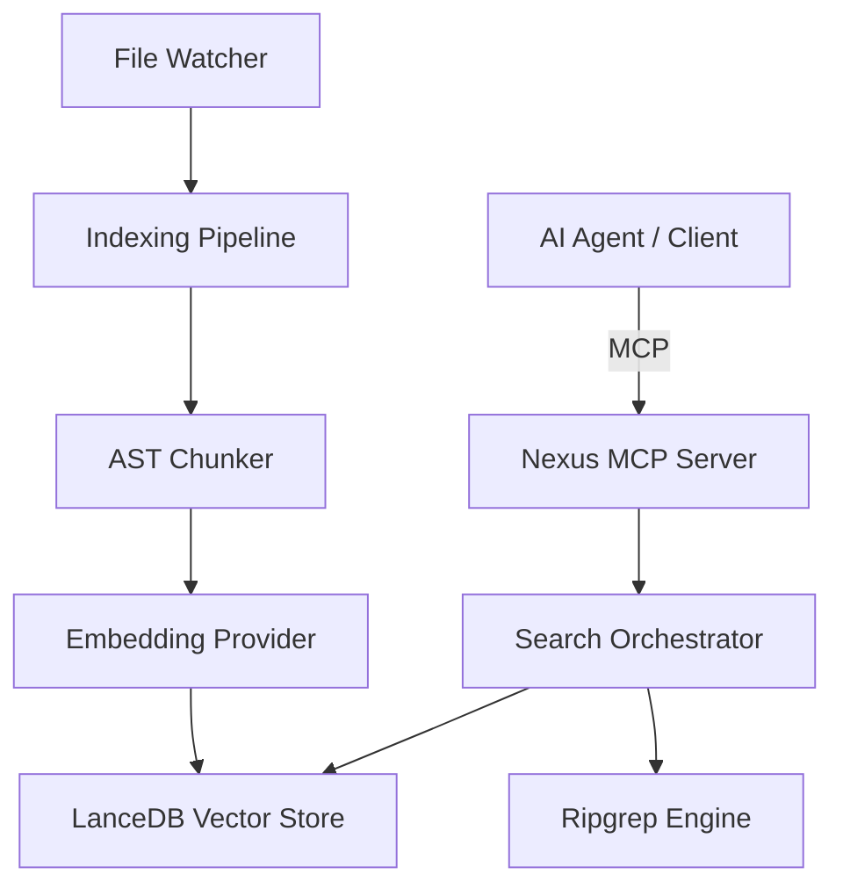

# Nexus ⚡️

**AI エージェントのための、ローカル MCP ベース・コードインデックス基盤**

[](https://opensource.org/licenses/MIT)
[](https://modelcontextprotocol.io/)

Nexus は、AI エージェントが巨大なコードベースを効率的に理解し、正確なコンテキストを取得するための MCP (Model Context Protocol) サーバーです。
Semantic search、Exact grep search、File context 取得を 1 つのローカルインデックスに集約し、高速かつ一貫性のある検索体験を提供します。

## 🚀 特徴

- **ハイブリッド検索**: LanceDB によるベクトル検索と ripgrep による高速な文字列検索を統合。
- **インテリジェント・チャンキング**: AST 解析に基づき、関数のセマンティクスを維持したままコードを分割。
- **低レイテンシ**: ローカル実行に特化し、ネットワーク遅延のない高速なレスポンスを実現。
- **ストリーミング対応**: 巨大な検索結果も Streamable HTTP transport により効率的に処理。
- **自律的メンテナンス**: ファイル監視 (Watcher) とデッドレターキュー (DLQ) による自動的なインデックス更新とリカバリ。
- **アプリケーション層 Observability**: MCP ツール利用状況、検索ヒット数、取得コンテキスト行数、Embedding API レイテンシを Prometheus メトリクスとして公開。
- **Telemetry Aggregator**: `nexus dashboard` が複数 Nexus プロセスのメトリクスを自動登録・集約し、Grafana から `localhost:9470/metrics` をスクレイプできます。
- **プロセス間排他制御・CPU負荷抑制**: `proper-lockfile` によるファイルベースのロックで同一プロジェクトへの複数プロセス同時起動や Ollama の CPU 奪い合いを防止。さらに、Ollama への埋め込みリクエスト単位でスレッド数を制限（デフォルト 2、範囲 1〜16）し、ホストマシンのレスポンシブネスを維持します。
- **プロジェクト単位の自動コネクター**: `nexus http-bridge` はプロジェクトごとに 1 つの loopback HTTP プロセスを自動的に発見・起動し、複数の MCP クライアントが同時に接続できます。最後のクライアントが切断すると自動的に停止するため、ポート番号や PID を手動管理する必要はありません。
- **CLI 手動リインデックス**: `nexus --reindex` で即座に 1 回だけインデックスを再構築し、`--full` を付けると clean full rebuild で実行します。
- **マルチ Embedding プロバイダ対応**: ローカルの `ollama`、OpenAI 互換 API (`openai-compat`) に加え、AWS Bedrock (Titan v2) を追加の代理サービスなしで直接呼び出せます。`NEXUS_PACKAGE_MODE=1` で provider を `bedrock` に固定する業務配布用の制限プロファイルも備えています。

## 🛠 セットアップ

### FOR HUMANS (推奨)

> [!TIP]
> 人間は環境構築や設定を打ち間違えることがあるため、AIエージェントに丸投げすることを強く推奨します。
> **Gemini CLI**, **Claude Code**, **Cursor** などの AI エージェントを使用している場合は、以下のプロンプトをコピーして貼り付けてください。
>
```text
Install and configure Nexus. First, read the local README.md and AGENTS.md in this repository. You MUST use your interaction tool (e.g., ask_user, input) to let me choose the installation method BEFORE executing any other commands.
```

#### 📝 エージェントの恒久的な設定（グローバル AGENTS.md への追記推奨）

AI エージェントが常にこの Nexus MCP を正しく、かつコンテキストを節約して使いこなせるようにするため、あなたのグローバルなエージェント指示書（例: `.github/copilot-instructions.md`、`.cursorrules`、グローバルの `AGENTS.md` など）に以下のガイドラインを追記することを強く推奨します。

````markdown
## Nexus MCP Server Usage Guidelines

When using **Nexus MCP** tools for codebase exploration and semantic search, adhere to these instructions for optimal performance and token budget.

### 1. WHAT & WHY (Project Overview)
- **Purpose**: Nexus is a local-first code indexing and search platform for AI agents, providing hybrid semantic search, ripgrep, and AST-based context parsing.

### 2. Tool Usage Rules (Playbook)
- **Index Status**: Run `index_status` before searching. If `pipelineProgress.status === 'running'`, search results may be incomplete.
- **Search Strategy**:
  - Use `hybrid_search` for semantic queries, vague feature exploration, or architectural questions (combines vector & ripgrep via RRF).
  - Use `grep_search` to pinpoint exact symbols, class/function names, or error strings.
- **Context Budgeting**:
  - When calling `get_context`, **DO NOT** read the entire file. Always specify `startLine` and `endLine` parameters to retrieve the minimal relevant snippet to conserve context tokens.
  - If you switch branches or make massive code changes, manually call `reindex` to refresh the local LanceDB store.

### 3. Project-Specific Context
- **Local Documentation**: In repositories where Nexus is active, refer to the project-local `SPEC.md` for architecture details and `AGENTS.md` for specific development constraints, if they exist.
````

<details>
<summary><h3>FOR AGENTS (AIエージェント向け手順)</h3></summary>

あなたがターミナル操作可能なAIエージェントであるなら、**まず [AGENTS.md](AGENTS.md) を読み込み、そこに記載された「MANDATORY PROTOCOL」に即座に従ってください。** 

**重要要件**:
- **ステップ0**: 独断で進めず、必ずお手持ちの**ユーザー対話ツール（`ask_user`, `input`, `confirm` 等）**を使用して、ユーザーに以下のいずれのインストール方式を希望するか確認してください。
- **PATの扱い**: 「ソースからビルド」を選択した場合、GitHub PAT (Personal Access Token) は**不要**です。`bootstrap` スクリプトが自動的に認証問題を回避するように設計されています。
- **秘匿情報の保護**: チャット内でユーザーにトークンの直接入力を求めることは禁止されています。

選択された方式に従って、[AGENTS.md](AGENTS.md) に集約されている詳細な手順を自律的に遂行してください。

より詳細な運用方法については [AGENTS.md](AGENTS.md) を参照してください。

#### 💡 運用ガイドライン (Playbook)

- **インデックス状態の確認**: 作業開始前に必ず `index_status` を呼び出し、インデックス構築が完了しているか（`pipelineProgress.status === 'idle'`）を確認してください。
- **検索の使い分け**:
  - **曖昧な探索・関連箇所の特定**: `hybrid_search` を最優先で使用してください。セマンティック検索と ripgrep が融合され、最適な結果が得られます。
  - **特定のシンボルやコード断片の検索**: `grep_search` を使用してください。特定のクラス名、関数定義、エラーメッセージなどをピンポイントで検出できます。
- **コンテキスト取得**: `get_context` でファイル全体を読み込むとLLMのコンテキストウィンドウを圧迫します。極力、必要な行範囲（`startLine` 〜 `endLine`）を絞り込んで部分的に取得してください。
- **インデックスの鮮度**: 大規模なファイル変更や `git checkout` によるブランチ切り替えの後は、`reindex` を呼び出してインデックスを手動で更新することを強く推奨します。

設定が必要な場合は、プロジェクトルートに `.nexus.json` を作成してください。

#### 🛠 MCP 設定例 (Claude Desktop / Gemini CLI)

各エージェントの設定ファイル（例: `claude_desktop_config.json`）の `mcpServers` セクションに以下を追加してください。

```json
{
  "mcpServers": {
    "nexus": {
      "command": "nexus",
      "args": [],
      "env": {
        "NEXUS_STORAGE_ROOT_DIR": "/path/to/your/project/.nexus"
      }
    }
  }
}
```

#### 🌉 HTTP Bridge 経由で接続する場合

stdio-only の MCP クライアント（OpenCode など）から使う場合は、`nexus http-bridge` を使います。Bridge は stdio 上の JSON-RPC を Nexus の Streamable HTTP エンドポイントに転送します。

引数なしで実行すると、プロジェクトごとに 1 つの loopback HTTP Nexus プロセスを自動的に発見または起動し、最後の MCP クライアントが切断すると自動的に停止します。descriptor は `<storage.rootDir>/endpoint.json` に保存され、デフォルトは `.nexus/endpoint.json` です。`NEXUS_STORAGE_ROOT_DIR` または `.nexus.json` の `storage.rootDir` で保存先を変更できます。ポート番号や URL を手動で管理する必要はありません。

同一プロジェクトに対して複数の MCP クライアント（複数のエディタウィンドウやエージェントなど）が同時に接続でき、それぞれ独立した MCP セッションを持ちながら同じインデックス（SQLite/LanceDB）や File Watcher を共有します。

```json
{
  "mcpServers": {
    "nexus": {
      "command": "nexus",
      "args": ["http-bridge"],
      "env": {
        "NEXUS_STORAGE_ROOT_DIR": "/path/to/your/project/.nexus"
      }
    }
  }
}
```

外部の Nexus HTTP サービスに明示的に接続したい場合は、`--url` 引数または `NEXUS_BRIDGE_URL` 環境変数で上書きできます。これらを指定した場合、Bridge は自動起動を一切行わず、指定 URL にのみ接続します。詳細は [docs/mcp-tools.md](docs/mcp-tools.md) を参照してください。

プロジェクトルートを明示的に指定したい場合は `--project-root <path>` 引数または `NEXUS_PROJECT_ROOT` 環境変数を使用します（未指定時はカレントディレクトリ）。

</details>

## 📖 使い方

### ダッシュボード (TUI) の起動

Nexus サーバーが起動している状態で、以下のコマンドを実行すると、ターミナル上でリアルタイムなインデックス状態やキューの監視が可能なダッシュボードが開きます。

```bash
# グローバルインストールされている場合
nexus dashboard

# ポート番号(指定時はそのポートを使用、未指定時は自動検出)や更新間隔(デフォルト: 2000ms, 最小: 1000ms)を指定する場合
nexus dashboard --port 9470 --interval 3000

# Aggregator の待受ポートを指定する場合（Prometheus/Grafana の scrape target）
nexus dashboard --aggregator-port 9470

# リポジトリ内からソースを直接実行する場合（Dashboard 単体のエントリーポイント）
npx tsx packages/dashboard/src/cli.ts --port 9470 --interval 3000
```

### メトリクス集約サーバー (Aggregator) の単体・デーモン起動

TUI（画面表示）を起動せずに、メトリクス集約サーバー (Aggregator) のみをバックグラウンドや systemd 等で常時起動しておきたい場合は、`aggregator` コマンドを使用します。

```bash
# 9470 ポート（デフォルト）で集約サーバーのみを起動
nexus-aggregator

# ポート番号を指定して起動する場合
nexus-aggregator --port 9472
```

#### systemd による自動起動（デーモン化）設定例

マシン起動時に集約サーバーが自動起動するようにするには、
`/etc/systemd/system/nexus-aggregator.service` を以下の内容で作成します。
`User` や `WorkingDirectory` はご利用の環境に合わせて適宜修正してください。

```ini
[Unit]
Description=Nexus Metrics Aggregator
After=network.target

[Service]
Type=simple
User=nexus
WorkingDirectory=/opt/nexus
ExecStart=/usr/bin/node dist/bin/aggregator.js
Restart=on-failure

[Install]
WantedBy=multi-user.target
```

サービスファイルを配置後、以下のコマンドで自動起動を有効化・起動します。

```bash
sudo systemctl daemon-reload
sudo systemctl enable nexus-aggregator
sudo systemctl start nexus-aggregator
```

### Prometheus / Grafana 連携

`nexus dashboard` は Telemetry Aggregator も起動します。各 Nexus サーバープロセスは自身のメトリクス HTTP サーバーを起動後、Aggregator に起動時および 30 秒間隔で登録します。Aggregator は登録済みノードの `/metrics/json` を並列取得し、`project` / `pid` ラベルで分離された Prometheus テキストへ再構築します。

Prometheus には以下の scrape target を設定してください。Grafana ダッシュボード JSON と詳細手順は [docs/observability/README.md](docs/observability/README.md) を参照してください。

```yaml
scrape_configs:
  - job_name: 'nexus'
    scrape_interval: 10s
    static_configs:
      - targets: ['localhost:9470']
```

### ライブラリとして組み込む

Nexus は Node.js プロセスに組み込んで、独自の MCP サーバーとして公開できます。

```ts
import { createServer } from 'node:http';
import { createNexusServer } from '@yohi/nexus';
import { createStreamableHttpHandler } from '@yohi/nexus/transport';

const handler = createStreamableHttpHandler({
  createServer: () => createNexusServer({
    /* config */
  }),
});

const server = createServer((req, res) => void handler(req, res));
server.listen(3000, '127.0.0.1');
```

### インデックスの手動更新

`nexus --reindex` を実行すると、即座に 1 回だけインデックスを再構築して終了します。`--full` を付けると incremental ではなく clean full rebuild で実行します。

## ⚙️ 設定

プロジェクトルートの `.nexus.json` で挙動をカスタマイズできます。詳細は [docs/configuration.md](docs/configuration.md) を参照してください。

### デフォルトの除外設定 (Watcher Ignore)

以下のディレクトリおよびファイルは、パフォーマンスとインデックスの正確性を維持するため、デフォルトで監視・インデックス対象から除外されます。

- **依存・ビルド**: `node_modules`, `dist`, `build`, `out`
- **ロックファイル**: `package-lock.json`, `pnpm-lock.yaml`, `yarn.lock`, `bun.lockb`, `*.lock`
- **内部データ**: `.git`, `.nexus`, `.worktrees`
- **テスト・キャッシュ**: `coverage`, `.cache`, `.parcel-cache`
- **Python キャッシュ**: `__pycache__`, `*.pyc`, `.pytest_cache`, `.mypy_cache`, `.ruff_cache`
- **仮想環境**: `venv`, `.venv`, `env`
- **エディタ・OS設定**: `.idea`, `.vscode`, `.DS_Store`
- **環境変数ファイル**: `.env`, `.env.*` は常に除外対象に追加されます（`ignorePaths` のカスタマイズでも除外できません）。

### 設定のカスタマイズ

除外対象を追加または変更するには、以下の方法があります。

1.  **`.nexus.json`**: プロジェクトルートに作成し、`watcher.ignorePaths` を指定します。
    > **注意**: `ignorePaths` を指定すると、デフォルトのリストは完全に置き換えられます（ただし `.env` / `.env.*` は常に追加されます）。既存のデフォルトを維持したい場合は、デフォルトのパス（`node_modules`, `.git` など）も一緒に列挙してください。
    ```json
    {
      "watcher": {
        "ignorePaths": ["node_modules", ".git", "custom_tmp"]
      }
    }
    ```
2.  **環境変数**: `NEXUS_WATCHER_IGNORE_PATHS` にカンマ区切りで指定します。
    > **注意**: 環境変数を指定した場合も、デフォルトのリストは上書きされます（マージされません）（ただし `.env` / `.env.*` は常に追加されます）。
    ```bash
    export NEXUS_WATCHER_IGNORE_PATHS="node_modules,.git,tmp"
    ```

### 主要な設定項目

| 環境変数 / キー | デフォルト値 | 説明 |
| :--- | :--- | :--- |
| `NEXUS_STORAGE_ROOT_DIR` | `<projectRoot>/.nexus` | インデックスデータの保存先 |
| `NEXUS_WATCHER_IGNORE_PATHS` | (上記デフォルトリスト) | 除外するパスのリスト。**この設定はデフォルトを上書きします。** |
| `NEXUS_PROJECT_NAME` / `projectName` | `<projectRoot>` のベース名 | Prometheus の `project` ラベルに使用するプロジェクト名 |
| `NEXUS_METRICS_PORT` / `metricsPort` | 自動割当 | Nexus プロセス自身の `/metrics`, `/metrics/json`, `/health` 待受ポート |
| `NEXUS_AGGREGATOR_PORT` / `aggregatorPort` | `9470` | Dashboard Aggregator の待受ポート |
| `NEXUS_EMBEDDING_PROVIDER` / `embedding.provider` | `ollama` | 使用する Embedding プロバイダー (`ollama`, `openai-compat`, `bedrock`)。`bedrock` は AWS Bedrock を直接呼び出します |
| `NEXUS_EMBEDDING_MODEL` / `embedding.model` | `nomic-embed-text` | Embedding モデル名 |
| `NEXUS_OLLAMA_NUM_THREAD` / `embedding.ollamaNumThread` | `2` | Ollama 埋め込みリクエストのスレッド数 (`1`〜`16`)。無効な値は `2` にフォールバック。 |
| `NEXUS_PACKAGE_MODE` / `packageMode` | `false` | `true` の場合、`embedding.provider` を `bedrock` にハードロック（fail-fast）。詳細は [docs/configuration.md](docs/configuration.md#package-mode) と [SPEC.md](SPEC.md) を参照 |

### Package Mode（業務配布用）

Nexus は単一コードベース上で、開発者向けのオリジナル動作（`packageMode=false`、デフォルト）と、社内向けに統制されたパッケージ版プラグイン（`packageMode=true`）の両方を提供します。

#### 特徴

- **Embedding プロバイダのロック**: `packageMode=true` の場合、`embedding.provider` に `bedrock`（AWS Bedrock）以外を指定するとサーバー起動時に fail-fast で例外を投げます（provider の値を自動的に書き換えるわけではありません）。`bedrock` を指定すれば正常に起動します。
- **可変値の許容**: `model` / `dimensions` / `region` はロック対象外で、デプロイ時に運用者が変更できます。
- **メトリクス層は維持**: ローカルの metrics HTTP サーバーおよび `nexus dashboard`（TUI）は `packageMode` の値に関わらず常に起動します。
- **外部連携のスキップ**: Grafana/Prometheus 向けの Aggregator への自動登録（Heartbeat）のみ `packageMode=true` でスキップされます。

#### 利用方法

**環境変数で有効化:**
```bash
NEXUS_PACKAGE_MODE=1 npx nexus
```

**`.nexus.json` で設定:**
```json
{
  "packageMode": true,
  "embedding": {
    "provider": "bedrock",
    "model": "amazon.titan-embed-text-v2:0",
    "dimensions": 1024,
    "region": "us-east-1"
  }
}
```

#### セットアップ

パッケージ版を利用する場合、以下の前提条件を満たしてください：

1. **AWS Bedrock モデルアクセスの有効化**: AWS コンソール → Bedrock → Model access で「Titan Embed Text v2」を有効化
2. **AWS 認証情報の設定**: 環境変数、AWS SSO、名前付きプロファイル、IAM ロールのいずれかで認証情報を用意
3. **GitHub Actions 変数の設定**（配布時）: `NEXUS_EMBEDDING_REGION`、`NEXUS_EMBEDDING_MODEL`、`NEXUS_EMBEDDING_DIMENSIONS` を設定

詳細は [docs/distribution.md](docs/distribution.md) の Prerequisites （P5: AWS 資格情報、P6: GitHub Actions 変数）を参照してください。

#### 配布フロー

Nexus は社内 Claude Code plugin marketplace（Bitbucket Cloud）を通じて `yohi-nexus` として配布されます。配布前提条件と運用手順は [docs/distribution.md](docs/distribution.md) にまとめられています。

## 🧰 MCP ツール一覧

詳細は [docs/mcp-tools.md](docs/mcp-tools.md) を参照してください。

| ツール名 | 説明 |
| :--- | :--- |
| `hybrid_search` | セマンティックと grep を組み合わせた強力な検索 |
| `semantic_search` | ベクトル検索による意味的なコード探索 |
| `grep_search` | ripgrep を用いた正確な文字列検索 |
| `get_context` | ファイルの指定範囲のコードをコンテキストとして取得 |
| `index_status` | 現在のインデックス進捗や統計情報の確認 |
| `reindex` | インデックスの手動再作成 |

## 🏗 アーキテクチャ

アーキテクチャの詳細な設計仕様、各コンポーネントの役割、およびセキュリティ機構については、[SPEC.md](SPEC.md) を参照してください。



## ⚠️ ライセンス

MIT License - 詳細は [LICENSE](LICENSE) ファイルを確認してください。
同梱されるサードパーティライセンスについては [NOTICE](NOTICE) を参照してください。
