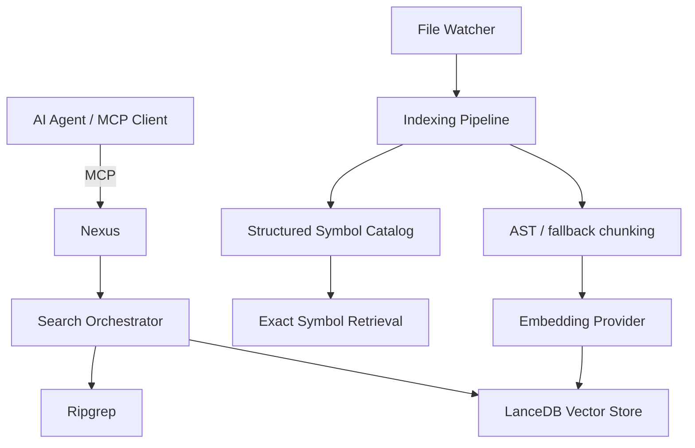

# Nexus

[日本語](README.ja.md)

[](https://opensource.org/licenses/MIT)
[](https://modelcontextprotocol.io/)

**A local-first MCP code index for fast, evidence-based code search and exact symbol retrieval.**

Nexus helps AI agents explore large codebases without repeatedly loading whole files. It combines semantic search, ripgrep, AST-aware indexing, exact symbol retrieval, and bounded context extraction behind one local MCP server.

> [!IMPORTANT]
> **v2 contains breaking changes.** The MCP tool contracts, CLI options, and configuration keys changed from v1. Use the current [MCP tool reference](docs/mcp-tools.md) and [configuration reference](docs/configuration.md) when migrating.

## Quick Start

### Requirements

- Node.js 24 or later
- npm
- An embedding provider. Ollama is the default local provider.

### Install and run

For the shortest repository-local path:

```bash
git clone https://github.com/yohi/nexus.git
cd nexus
npm ci
npm run build
node dist/bin/nexus.js
```

The published `@yohi/nexus` package uses GitHub Packages and requires registry/authentication setup. See [Setup](docs/setup.md) for Package Usage.

Nexus stores project-local index data under `<projectRoot>/.nexus` by default.

### Verify the index

Connect your MCP client to the `nexus` command, then call `index_status`.

A usable index has a non-null `indexStats.lastIndexedAt` and no `pipelineProgress.lastError`. Initial indexing runs in the background; searches can run while indexing is in progress, but results may be incomplete.

For client-specific setup and the Source Build / Package Usage choice, see [Setup](docs/setup.md).

## Features

- **Hybrid search** — semantic vector search and ripgrep results fused with Reciprocal Rank Fusion.
- **Exact search** — fast exact text and regex search through ripgrep.
- **Structured symbol retrieval** — stable `symbolId` values for TypeScript/JavaScript, Python, Go, Rust, Java, C#, C, and C++, with exact source, bounded context, and file outlines.
- **Incremental indexing** — file watching, diff detection, and recovery queues keep indexes current.
- **Local-first operation** — Ollama can keep source-derived embedding data on the host; externally configured embedding providers may transmit source-derived text to those services.
- **Observability** — Prometheus metrics and a dashboard/aggregator for multi-process monitoring.
- **HTTP bridge and server modes** — stdio clients can connect to a project-scoped local HTTP server without manually managing ports or PIDs.

## Agent Setup

Repository-wide AI-agent behavior belongs in [AGENTS.md](AGENTS.md). The canonical code-search workflow is [.agents/skills/code-search.md](.agents/skills/code-search.md).

For a typical search:

1. Check `index_status`.
2. Use `hybrid_search` for conceptual exploration or `grep_search` for exact text.
3. When a result has a usable `symbolId`, prefer `get_symbol_source` or `get_symbol_context`.
4. Use `get_context` for line-oriented hits, unsupported/degraded structured retrieval, or other non-symbol cases.

See [MCP Tools](docs/mcp-tools.md) for the complete public tool reference.

## Usage

### Rebuild the index

```bash
nexus --reindex
nexus --reindex --full
```

`--full` performs a clean full rebuild.

### Run a local HTTP MCP server

```bash
nexus serve
nexus serve --host 127.0.0.1 --port 9200
```

Local HTTP v2 is loopback-only by design. See [SPEC.md](SPEC.md) for the current transport and safety invariants.

### Use the stdio HTTP bridge

```bash
nexus http-bridge
```

The bridge discovers or starts the project-scoped local HTTP server and forwards stdio JSON-RPC traffic to the Streamable HTTP endpoint.

### Dashboard

```bash
nexus dashboard
```

For aggregator and Grafana/Prometheus setup, see [Observability](docs/observability/README.md).

## How It Works


```mermaid
graph TD
    Client[AI Agent / MCP Client] -->|MCP| Server[Nexus]
    Server --> Search[Search Orchestrator]
    Search --> Vector[LanceDB Vector Store]
    Search --> Grep[Ripgrep]
    Watcher[File Watcher] --> Pipeline[Indexing Pipeline]
    Pipeline --> Chunker[AST / fallback chunking]
    Chunker --> Embed[Embedding Provider]
    Embed --> Vector
    Pipeline --> Structured[Structured Symbol Catalog]
    Structured --> Exact[Exact Symbol Retrieval]
```

Search chunks and logical symbols are separate retrieval units. Semantic results can identify a symbol, while structured retrieval reads and verifies the complete logical declaration from the current working tree.

For architecture invariants and current behavioral contracts, see [SPEC.md](SPEC.md).

## Configuration

Nexus reads project configuration from `.nexus.json` and supports environment-variable overrides for supported settings. Important examples include:

| Setting | Purpose |
| --- | --- |
| `NEXUS_STORAGE_ROOT_DIR` / `storage.rootDir` | Index storage location |
| `NEXUS_EMBEDDING_PROVIDER` / `embedding.provider` | `ollama`, `openai-compat`, or `bedrock` |
| `NEXUS_WATCHER_IGNORE_PATHS` / `watcher.ignorePaths` | Additional watcher/index exclusions |
| `NEXUS_PACKAGE_MODE` / `packageMode` | Package-distribution constraints |

Do not treat this table as the complete configuration contract. See [Configuration](docs/configuration.md).

## Documentation

| Reader / task | Canonical document |
| --- | --- |
| Current architecture, invariants, compatibility, transport behavior | [SPEC.md](SPEC.md) |
| AI-agent repository instructions | [AGENTS.md](AGENTS.md) |
| Code-search agent workflow | [.agents/skills/code-search.md](.agents/skills/code-search.md) |
| MCP tools, inputs, outputs, and status values | [docs/mcp-tools.md](docs/mcp-tools.md) |
| Installation and client setup | [docs/setup.md](docs/setup.md) |
| Runtime configuration | [docs/configuration.md](docs/configuration.md) |
| Distribution and operator workflow | [docs/distribution.md](docs/distribution.md) |
| Metrics and dashboards | [docs/observability/README.md](docs/observability/README.md) |
| Future target state | [ROADMAP.md](ROADMAP.md) |
| Released changes | [CHANGELOG.md](CHANGELOG.md) |

## Development

```bash
npm ci
npm run build
npm run lint
npx tsc --noEmit
npx vitest run
```

Run focused tests first when changing a specific subsystem, then run the full relevant checks before completion.

## License

MIT. See [LICENSE](LICENSE) and [NOTICE](NOTICE).
